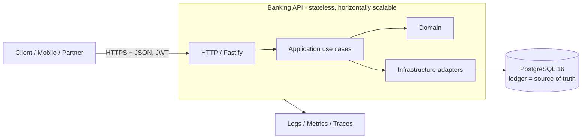
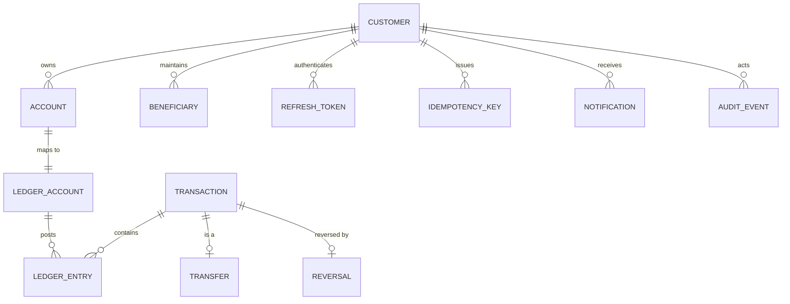
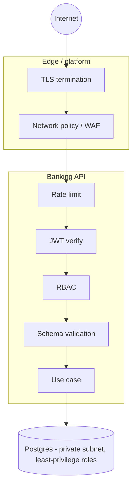

# Architecture

> Status: living document. Last reviewed: see `git log -1 -- docs`.
> Audience: engineers operating or extending a system that moves real money.

This document describes _why_ the system is shaped the way it is. The
step-by-step "what" lives in the code and the other docs (`LEDGER.md`,
`DATABASE.md`, `API.md`, `SECURITY.md`, `RELIABILITY.md`, `DECISIONS.md`).

---

## 1. Context and constraints

| Constraint         | Value                                                                                  |
| ------------------ | -------------------------------------------------------------------------------------- |
| Domain             | Retail banking backend: customers, accounts, deposits, withdrawals, internal transfers |
| Legacy code        | None. The repository was empty scaffolding (README/LICENSE/stubs only).                |
| Language / runtime | Node.js ≥ 20 + TypeScript (strict)                                                     |
| Database           | PostgreSQL 16                                                                          |
| Deployment         | Single stateless service + one Postgres. Containerised.                                |
| Non-negotiables    | Financial correctness, immutability, auditability, no floating point money             |

Because there was **no** prior stack to respect, we optimised for the property
that matters most in finance: _the ability to prove what happened_. That drove
three choices that everything else follows from (see `DECISIONS.md`):

1. **A double-entry ledger is the source of truth.** Balances are a cache.
2. **One relational database with real constraints and transactions.** No
   distributed system, no eventual consistency in the money path.
3. **Explicit SQL over ORM magic.** Money queries must be readable and
   reviewable, and locking must be visible.

---

## 2. System context



Statelessness is deliberate: any instance can serve any request, so we can
scale out and restart freely. All coordination happens in Postgres
(row locks, unique constraints, transactions), never in process memory.

---

## 3. Layered architecture

```
src/
  domain/          pure business rules, value objects, errors. No I/O, no framework.
  application/     use cases + port interfaces. Orchestration, transaction intent.
  infrastructure/  adapters: Postgres repositories, crypto, idempotency, risk, audit.
  http/            Fastify transport: routing, validation, auth, error mapping.
  config/          validated environment.
  observability/   logger + metrics.
  container.ts     composition root (wires ports -> adapters).
```

Dependency rule: **inward only.**

```
http/ ──► application/ ──► domain/
                ▲
infrastructure/ ┘   (implements application/ ports; depends on domain)
```

- `domain` imports nothing from the app (not even `node:http` or `pg`).
- `application` depends on interfaces it defines (`ports.ts`), so it can be
  unit-tested with in-memory fakes and never knows Fastify or SQL exist.
- `infrastructure` is the only layer that talks to Postgres or the OS.
- `http` is the only layer that knows about HTTP status codes.

This is not dogma — it buys three concrete things: (a) ledger invariants are
tested without a DB, (b) the transport can be replaced (gRPC/GraphQL) without
touching money logic, (c) a reviewer can audit the money path in `domain` +
`application` alone.

---

## 4. Domain model



Key entities:

- **Customer** — the authenticated principal (`role ∈ {customer, support, admin}`).
- **Account** — a customer-facing bank account (the thing a user sees).
- **Ledger account** — a chart-of-accounts node. Every customer Account maps
  1:1 to a _liability_ ledger account (the bank owes the customer). System
  accounts (cash/settlement, fees, suspense) are ledger accounts with no
  customer Account.
- **Transaction** — the immutable journal header for one money movement.
- **Ledger entry** — one debit or one credit. A transaction's entries must sum
  to zero.
- **Transfer / Reversal** — domain facts linked to a Transaction so we can
  query intent without parsing ledger rows.

The full DDL with constraints and rationale is in `DATABASE.md` and
`migrations/0001_init.sql`.

---

## 5. The money path (application services)

```
LedgerService  ── the only component allowed to create ledger entries
  ├─ deposit()          external money in
  ├─ withdraw()         external money out
  ├─ transfer()         between two customer accounts
  └─ reverse()          compensating transaction (never an UPDATE/DELETE)
```

Everything else (`AccountService`, `StatementService`, `BeneficiaryService`,
`AdminService`, `AuthService`) calls into `LedgerService` or reads projections.

### Transaction boundary

**One HTTP request that moves money = exactly one database transaction.**
Inside that transaction we do all of:

1. reserve/lookup the idempotency key,
2. lock the affected account rows (deterministic order),
3. validate policy (status, currency, limits, risk),
4. insert the `transactions` row,
5. insert the balanced `ledger_entries`,
6. update each `accounts.cached_balance`,
7. write `audit_events`,
8. enqueue `notifications` (transactional outbox),
9. complete the idempotency key with the response payload.

Commit is atomic. If anything throws, Postgres rolls the whole thing back and
**no** partial state exists. This is the single most important design rule in
the system.

### Why READ COMMITTED + explicit locks (not SERIALIZABLE)

`SERIALIZABLE` is correct but forces retries under contention and makes failure
modes harder to reason about. Instead we use the default **READ COMMITTED** and
take explicit `SELECT ... FOR UPDATE` row locks on the accounts that will change
balance, **ordered by `id`** so two concurrent transfers cannot deadlock. This
gives deterministic locking with simple, well-understood semantics. Retry logic
still exists for the rare serialization/deadlock error as defence in depth. See
`DECISIONS.md` ADR-0004.

### Balance integrity, belt and braces

- `accounts.cached_balance` is updated **in the same transaction** as entries.
- `cached_balance` has a `CHECK (cached_balance >= 0)` for non-overdraft
  accounts, so even a logic bug cannot post a negative customer balance.
- A reconciliation routine re-derives every balance from `ledger_entries` and
  asserts equality (`ReconciliationService`, `GET /v1/admin/reconciliation`).

---

## 6. Idempotency

`POST` financial endpoints require an `Idempotency-Key` header.

```
(client retries)                       ┌─────────────────────────────┐
    │  key=K body=B                    │ idempotency_keys            │
    ▼                                  │  PK (customer,key,endpoint) │
[begin tx]                             │  request_hash, status,      │
  INSERT ... ON CONFLICT DO NOTHING ──►│  response_body, txn_id      │
  ├ no row inserted? -> load existing  └─────────────────────────────┘
  │    ├ status=completed & hash=B -> replay stored response (no money moves)
  │    ├ status=completed & hash≠B -> 422 idempotency_key_reuse
  │    └ status=in_progress (fresh) -> 409 concurrent duplicate
  └ inserted? -> run money movement, store response, COMMIT (atomic)
```

The idempotency row is written **inside the same transaction** as the money
movement, so a crash can never leave "money moved but key not recorded" or vice
versa. A stale `in_progress` key (holder crashed) can be taken over after a
timeout. Full semantics in `DECISIONS.md` ADR-0005.

---

## 7. Security boundaries



- **Authentication:** short-lived JWT access token + opaque, rotating refresh
  token (stored hashed).
- **Authorization:** role checks in a dedicated plugin; ownership checks in the
  application layer (a customer may only touch their own accounts/beneficiaries).
- **Trust boundary:** the client sends only _intent_ (amount, source, target).
  It never sends a balance, a ledger entry, or an id it could forge into a
  money movement.
- Full threat model and controls: `SECURITY.md`.

---

## 8. Failure scenarios (design-time)

| Failure                                            | Behaviour                                                                                                                                                |
| -------------------------------------------------- | -------------------------------------------------------------------------------------------------------------------------------------------------------- |
| Client retries a transfer                          | Idempotency key replays the stored response; money moves once.                                                                                           |
| Two concurrent transfers to one account            | Row lock serialises them; both post; balance correct.                                                                                                    |
| Deadlock between two opposite transfers            | Locks acquired in `id` order ⇒ deadlock avoided; residual `40P01`/`40001` retried with jittered backoff.                                                 |
| Process crashes mid-transaction                    | Postgres rolls back; idempotency row also rolls back; retry is safe.                                                                                     |
| Process crashes after COMMIT, before HTTP response | Client retries same key ⇒ replays stored response.                                                                                                       |
| DB unavailable                                     | Requests fail fast (connection timeout) with `503`; readiness probe fails; no money moves.                                                               |
| Notification delivery fails                        | Notification is committed in the outbox with `status=pending`; a worker retries at-least-once; notifications are idempotent by `(transaction_id, type)`. |
| Duplicate notification                             | Unique constraint on `(transaction_id, type)` dedupes.                                                                                                   |

---

## 9. Observability

- **Structured JSON logs** (pino) with a correlation `requestId` and, when
  authenticated, `customerId`. Secrets, tokens, hashes and full account numbers
  are redacted at the logger boundary.
- **Metrics** (Prometheus via `prom-client`): HTTP latency/status histograms,
  ledger posting counters, idempotency replay/conflict counters, rate-limit
  hits, DB pool gauges.
- **Health:** `/health/live` (process up) and `/health/ready` (DB reachable).
- **Audit:** every state change writes an append-only `audit_events` row in the
  same transaction as the change.

---

## 10. Testing strategy

| Layer                                                            | Tool                    | Runs without DB? |
| ---------------------------------------------------------------- | ----------------------- | ---------------- |
| Domain unit (money, ledger math, errors)                         | Vitest                  | ✅               |
| Application use cases with in-memory fakes                       | Vitest                  | ✅               |
| Repository / SQL integration                                     | Vitest + real Postgres  | ❌               |
| Financial invariants (debits == credits, no money creation)      | Vitest + real Postgres  | ❌               |
| Concurrency (parallel withdrawals/transfers, duplicate requests) | Vitest + real Postgres  | ❌               |
| Security (authz, enumeration, injection, rate limit)             | Vitest + Fastify inject | partial          |
| HTTP contract / OpenAPI                                          | Vitest + Fastify inject | partial          |

Integration tests boot an ephemeral PostgreSQL automatically
(`embedded-postgres`) when `TEST_DATABASE_URL` is unset; CI provides a Postgres
service container. See `tests/README` inside the test tree and `CONTRIBUTING.md`.

---

## 11. Explicit assumptions and non-goals

Assumptions (documented rather than blocked on):

- **Single currency per account.** A transfer requires equal currencies; FX is
  a separate product. Rejected with `currency_mismatch`.
- **No overdraft** in v1; `cached_balance >= 0` is a hard constraint.
- **Integer minor units, `BIGINT`.** No floating point anywhere.
- **Internal transfers only.** External rails (ACH/SEPA/card networks) are out
  of scope; a deposit/withdrawal is modelled as money moving between a customer
  account and a system settlement account.

Non-goals (deliberately deferred, see final review in `README.md`):
multi-region active/active, per-account sharding, event sourcing beyond the
audit log, and external payment rails. Building these prematurely would add
failure modes without evidence they are needed.
