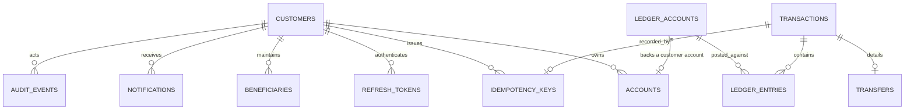

# Database

PostgreSQL 16. The schema is defined by forward-only, checksummed SQL migrations
in [`migrations/`](../migrations) and applied with `npm run migrate`
(see [ADR-0009](DECISIONS.md)).

---

## Conventions

- **UUID primary keys** (`gen_random_uuid()`): non-enumerable, safe to expose.
- **Money is `BIGINT` minor units.** Never `numeric`, never `float`. `pg`
  returns `int8` as a `bigint` (configured once in `src/infrastructure/db/pool.ts`).
- **`timestamptz` everywhere**, defaulted to `now()`.
- **Constraints encode rules** so the database, not just the app, is the last
  line of defence.
- **Soft deletion** (`deleted_at`) on customer-facing rows (customers, accounts,
  beneficiaries); financial rows (`transactions`, `ledger_entries`) are never
  deleted.
- **Indexes exist for known query patterns only**, documented inline below.

---

## Entity-relationship overview



---

## Tables

### `customers`

The authenticated principal. `email` is stored lower-cased with
`CHECK (email = lower(email))` so no case-variant duplicate can exist (avoids a
`citext` dependency). Carries `role` (`customer|support|admin`), `status`,
failed-login counters, and lockout state.

> Index: unique `email`; no extra index needed (login is the only lookup).

### `refresh_tokens`

Opaque refresh tokens, **stored hashed** (`sha256`). Supports rotation
(`replaced_by_id`) and family revocation.

> Partial index `refresh_tokens_customer_active_idx (customer_id) WHERE revoked_at IS NULL` supports "revoke all sessions for a user" and reuse detection.

### `ledger_accounts`

The chart of accounts. `type ∈ {asset,liability,equity,revenue,expense}`,
`currency`, `is_system`. Customer accounts map 1:1 to a `liability` account with
code `CUST:<accountNumber>`; bank-side accounts use `SYS:*`.

### `accounts`

A customer-facing account. `UNIQUE (ledger_account_id)`,
`UNIQUE (account_number)` with `CHECK (account_number ~ '^[0-9]{10}$')`.
Holds the **cached** balance and a hard overdraft guard:

```sql
CONSTRAINT accounts_no_negative_balance
  CHECK (allow_overdraft OR cached_balance_minor >= 0)
```

> Partial index `accounts_customer_active_idx (customer_id) WHERE deleted_at IS NULL` for the account listing page.

### `transactions`

Immutable journal header: `reference` (unique, human-readable), `type`,
`currency`, `amount_minor`, `initiated_by`, optional `reversal_of_id`.

> Index `transactions_initiated_by_created_idx (initiated_by, created_at DESC)` for ops lookups.

### `ledger_entries`

The heart. `transaction_id`, `ledger_account_id`, `direction`
(`debit|credit`), `amount_minor > 0`, `currency`.

```sql
CONSTRAINT ledger_entries_leg_unique UNIQUE (transaction_id, ledger_account_id, direction)
```

> Index `ledger_entries_account_created_idx (ledger_account_id, created_at)` powers balance derivation and statements (range scans).
> Index `ledger_entries_transaction_idx (transaction_id)` loads all legs of a transaction.

### `transfers`

Transfer-specific detail (source, destination, amount, fee, note) linked to its
`transaction_id`. `CHECK (from_account_id <> to_account_id)` forbids self-transfer.

### `idempotency_keys`

`UNIQUE (customer_id, endpoint, key)`; stores the request fingerprint and the
replayed response. Written **in the same transaction** as the movement it
guards. Partial index on `expires_at` for garbage collection.

### `beneficiaries`

Saved payees. `UNIQUE (customer_id, account_number, bank_code)`; soft-deleted.

### `notifications`

Transactional outbox. `UNIQUE (transaction_id, type)` makes at-least-once
delivery effectively-once. Partial index on pending rows for a worker to claim.

### `audit_events`

Append-only. `actor_id`, `action`, `entity_type`, `entity_id`, `request_id`,
`ip`, `metadata jsonb`. Indexed by entity and by actor.

---

## Integrity triggers (`0002_integrity.sql`)

| Trigger                                                 | Tables                                                                | Effect                                                     |
| ------------------------------------------------------- | --------------------------------------------------------------------- | ---------------------------------------------------------- |
| `set_updated_at`                                        | customers, accounts, ledger_accounts, notifications, idempotency_keys | Maintains `updated_at`                                     |
| `forbid_mutation`                                       | ledger_entries, transactions, audit_events                            | Raises on `UPDATE`/`DELETE` — posted records are immutable |
| `ledger_entries_balanced` (deferred constraint trigger) | ledger_entries                                                        | At `COMMIT`, raises if a transaction's debits ≠ credits    |

The deferred balance trigger is the strongest guarantee in the system: **no
application bug can commit an unbalanced transaction.**

---

## Migration policy

- `migrations/NNNN_name.sql`, applied in filename order, each in its own
  transaction, recorded in `schema_migrations` with a `sha256` checksum.
- Editing an applied migration is a hard error (`checksum mismatch`). Corrections
  are **new** migrations.
- Forward-only. In finance you restore from backup/PITR; you do not write
  down-migrations that might silently drop money.

```bash
npm run migrate           # apply pending
npm run migrate:status    # list pending without applying
```

---

## Operational notes

- **Connection pool** sized by `DB_POOL_MAX`; `statement_timeout` set from
  env prevents runaway queries.
- **Idle-client errors** are logged (never crash the process).
- **Backups/PITR, replication, and failover** are platform responsibilities; the
  application assumes a single primary and uses only standard SQL features.
- The integrity functions use `plpgsql`, which is available in every supported
  PostgreSQL build (including the embedded instance used by tests).
