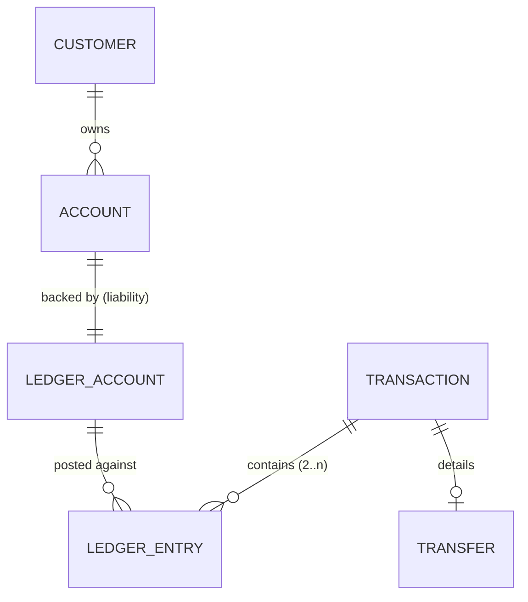

# The Ledger

> The ledger is the source of truth. Everything else — including the balance a
> customer sees — is a projection that can be re-derived from it.

This document explains the accounting model, the invariants, how each operation
is posted, and how the system proves it stayed correct.

---

## 1. Double-entry bookkeeping in one minute

In double-entry accounting, money never appears or disappears by editing a
balance. Every movement is a **transaction** containing **ledger entries**, each
a **debit** or a **credit** against an **account**, such that:

```
sum(debts) == sum(credits)
```

Each account has a _normal balance_ side on which it increases:

| Ledger account type | Normal side | Increases on | Examples here                                   |
| ------------------- | ----------- | ------------ | ----------------------------------------------- |
| `asset`             | debit       | debit        | `SYS:CASH:USD` (money the bank holds)           |
| `liability`         | credit      | credit       | a customer account (the bank owes the customer) |
| `revenue`           | credit      | credit       | `SYS:FEE_REVENUE:USD`                           |
| `equity`            | credit      | credit       | (reserved)                                      |
| `expense`           | debit       | debit        | (reserved)                                      |

A **customer's balance** is the balance of their **liability** ledger account:
`credits - debits`. When the bank owes the customer more, the customer's balance
goes up.

`Money` is an integer count of minor units (`BIGINT` in the database, `bigint` in
code) plus an ISO-4217 currency. Floating point is never used — see
[ADR-0002](DECISIONS.md#adr-0002--money-is-an-integer-in-minor-units-never-floating-point).

---

## 2. The object model



- A customer-facing **Account** maps 1:1 to a **liability ledger account**
  (code `CUST:<accountNumber>`).
- The bank holds money in **system asset accounts** (`SYS:CASH:<CUR>`) and
  records fee income in `SYS:FEE_REVENUE:<CUR>`. These are seeded by
  `npm run seed`.
- A **Transaction** is the immutable journal header for exactly one movement.
- A **Ledger Entry** is one debit or one credit of that transaction.

The full DDL (constraints, indexes, triggers) is in
[`migrations/0001_init.sql`](../migrations/0001_init.sql) and
[`migrations/0002_integrity.sql`](../migrations/0002_integrity.sql), and is
narrated in [DATABASE.md](DATABASE.md).

---

## 3. How each operation is posted

All plans are pure functions in [`src/domain/ledger.ts`](../src/domain/ledger.ts)
and are unit-tested without a database.

### Deposit (money in)

The bank receives cash (asset ↑) and owes the customer more (liability ↑).

```
debit   SYS:CASH:USD        +amount    (asset increases)
credit  CUST:<acct>         +amount    (liability increases → balance up)
```

### Withdrawal (money out)

```
debit   CUST:<acct>         +amount    (liability decreases → balance down)
credit  SYS:CASH:USD        +amount    (asset decreases)
```

### Internal transfer

```
debit   CUST:<from>         +amount    (sender balance down)
credit  CUST:<to>           +amount    (receiver balance up)
```

### Reversal (correction)

Never an edit. A reversal is a **new transaction** whose entries mirror the
original with sides swapped, and which records `reversal_of_id`:

```
original:  debit CUST:A 100   credit CUST:B 100
reversal:  credit CUST:A 100  debit  CUST:B 100
```

---

## 4. Invariants

These are the promises the system makes. Each is enforced in the domain, the
database, or both — and each has a failing test that proves enforcement.

| #   | Invariant                                             | Enforced by                                                                                            |
| --- | ----------------------------------------------------- | ------------------------------------------------------------------------------------------------------ |
| L1  | Σ debits == Σ credits for every transaction           | `assertBalanced()` **and** deferred `CONSTRAINT TRIGGER ledger_entries_balanced` (rejects at `COMMIT`) |
| L2  | Every ledger entry has a strictly positive amount     | domain + `CHECK (amount_minor > 0)`                                                                    |
| L3  | A posted transaction is immutable                     | `BEFORE UPDATE OR DELETE` trigger `forbid_mutation()`                                                  |
| L4  | A posted ledger entry is immutable                    | same trigger                                                                                           |
| L5  | Every transaction has a unique id and human reference | `uuid` PK + `UNIQUE (reference)`                                                                       |
| L6  | Every movement is auditable                           | `audit_events` written in the same transaction                                                         |
| L7  | A customer balance is derivable from the ledger       | reconciliation recomputes `credits - debits` and compares to `cached_balance`                          |
| L8  | A customer balance cannot go negative (no overdraft)  | application check + `CHECK (allow_overdraft OR cached_balance >= 0)`                                   |
| L9  | A failed operation leaves no partial financial state  | one SQL transaction per movement; rollback on any error                                                |
| L10 | A retried request never duplicates a movement         | idempotency key committed with the movement                                                            |
| L11 | A given leg can only be posted once per transaction   | `UNIQUE (transaction_id, ledger_account_id, direction)`                                                |

### Why balance is checked in the database too

`assertBalanced()` runs in application code for a fast, clear error — but the
**deferred constraint trigger** is the real guarantee. It fires once at `COMMIT`
(after all legs of the transaction are inserted) and raises if the transaction
is not balanced. A bug in application logic cannot commit unbalanced entries.

See `tests/integration/invariants.test.ts`:

```ts
it('refuses to commit an unbalanced transaction', async () => {
  await expect(pool.query('/* single-sided debit */')).rejects.toThrow(/not balanced/i);
});
```

---

## 5. Cached balances vs. the ledger

Reading a balance must be fast, so `accounts.cached_balance_minor` is maintained
**inside the same transaction** as the entries that change it. It is a cache,
not a source of truth:

```
cached_balance = Σ(credits) − Σ(debits)   over the account's ledger account
```

Two projections must agree, so reconciliation exists:

- **`GET /v1/admin/accounts/:id/reconcile`** — recomputes the balance from the
  ledger for one account and reports any difference.
- **`GET /v1/admin/reconciliation`** — verifies global `Σ debits == Σ credits`
  and lists _every_ account whose cached balance differs from its ledger balance.

A non-empty mismatch list is an operational alarm, not a normal outcome. The
integration suite asserts it is empty after deposits, withdrawals, and
concurrent transfers.

---

## 6. Reconciliation job

`ReconciliationService` (in `src/application/`) is the primitive a scheduled job
should call. The single-account form is one indexed aggregate:

```sql
SELECT COALESCE(SUM(CASE WHEN direction = 'credit' THEN amount_minor
                         ELSE -amount_minor END), 0)
  FROM ledger_entries
 WHERE ledger_account_id = $1;
```

The global form checks the accounting equation across all entries and scans for
drift. In production this should run on a schedule and alert on any mismatch.

---

## 7. Worked example

Start: Ada has account `CUST:0000000001` with balance `0`.

1. **Deposit 100.00 USD**

   | entry | account           | direction | amount (minor) |
   | ----- | ----------------- | --------- | -------------- |
   | e1    | `SYS:CASH:USD`    | debit     | 10000          |
   | e2    | `CUST:0000000001` | credit    | 10000          |

   Balance: `10000 − 0 = 10000` → **100.00 USD**.

2. **Transfer 30.00 USD to Bob** (`CUST:0000000002`, currently `0`)

   | entry | account           | direction | amount |
   | ----- | ----------------- | --------- | ------ |
   | e3    | `CUST:0000000001` | debit     | 3000   |
   | e4    | `CUST:0000000002` | credit    | 3000   |

   Ada: `10000 − 3000 = 7000`. Bob: `3000`.

3. **Reverse the deposit** (admin). The deposit's entries are swapped:

   | entry | account           | direction | amount |
   | ----- | ----------------- | --------- | ------ |
   | e5    | `CUST:0000000001` | debit     | 10000  |
   | e6    | `SYS:CASH:USD`    | credit    | 10000  |

   Ada: `7000 − 10000 = −3000` → **refused** if the account does not allow
   overdraft (L8). This is the documented limitation: a bank routes this through
   a suspense/overdraft facility rather than silently going negative.

At every step, `Σ debits == Σ credits`, and no entry was ever modified.

---

## 8. Design rules (do not break these)

1. **Never edit a ledger entry or a posted transaction.** Post a reversal.
2. **Never write a balance without the corresponding entries** in the same
   transaction.
3. **Never compute money in floating point.** Use `Money` / `bigint`.
4. **Never trust a client-provided balance.** The client sends intent only.
5. **Never retry a money operation without an idempotency key.**
