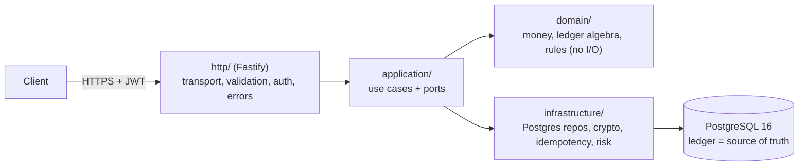

<div align="center">

# Banking System

**A production-grade, double-entry banking backend where the ledger is the source of truth.**

Idempotent money movement · concurrency-safe transfers · immutable posted records · RBAC · audit · observability

[](../../actions/workflows/ci.yml)
&nbsp;·&nbsp; Node.js ≥ 20 · TypeScript · PostgreSQL 16

</div>

---

## What this is

A modular, **correctness-first** banking backend: registration and authentication,
multiple accounts per customer, deposits, withdrawals, internal transfers,
statements, beneficiaries, double-entry bookkeeping, idempotent operations,
reconciliation, audit logs, notifications, RBAC, administrative operations,
rate limiting, risk checks, and production observability.

It is deliberately **not** a feature-bloated toy. Every design decision favours
_provable financial correctness_ over convenience. Money is never a float, a
balance is never trusted from the client, a posted record is never mutated, and
a retried request never moves money twice.

> **The five questions this system is built to answer, always:**
>
> 1. What happens if this operation fails halfway through?
> 2. What happens if two requests execute simultaneously?
> 3. What happens if the client retries the request?
> 4. Can money be created, destroyed, or duplicated?
> 5. Can an engineer prove exactly what happened months later?

---

## Core guarantees

| Guarantee                             | How it is enforced                                                                                                                              |
| ------------------------------------- | ----------------------------------------------------------------------------------------------------------------------------------------------- |
| **Money is exact**                    | Integer minor units in `BIGINT`, `bigint` in code. No floating point anywhere.                                                                  |
| **Debits = credits, always**          | `assertBalanced()` in the domain **and** a deferred `CONSTRAINT TRIGGER` that rejects any unbalanced transaction at `COMMIT`.                   |
| **Posted records are immutable**      | `BEFORE UPDATE OR DELETE` triggers on `ledger_entries`, `transactions`, `audit_events`. Corrections are new compensating transactions.          |
| **No lost updates / no double-spend** | `READ COMMITTED` + `SELECT … FOR UPDATE` acquired in sorted id order; a `CHECK (cached_balance >= 0)` guards against overdraft at the DB level. |
| **Retries never duplicate money**     | Persisted `Idempotency-Key` reserved and completed in the **same transaction** as the movement.                                                 |
| **Balances are provable**             | `cached_balance` is written in-transaction and independently reconciled against the ledger via `/v1/admin/reconciliation`.                      |
| **Everything is auditable**           | Append-only `audit_events` written in the same transaction as every state change.                                                               |

Each is verified by tests: `tests/integration/invariants.test.ts` proves the
database _refuses_ to commit an unbalanced transaction, mutate a posted entry,
or delete a transaction.

---

## Architecture at a glance



Dependencies point **inward only**; the domain imports nothing. The money path
lives in `domain/` + `application/` and is unit-testable without a database.
Full rationale, diagrams, and tradeoffs: **[ARCHITECTURE.md](ARCHITECTURE.md)**
and **[DECISIONS.md](DECISIONS.md)** (ADRs).

---

## Documentation

| Document                           | Contents                                                                          |
| ---------------------------------- | --------------------------------------------------------------------------------- |
| [ARCHITECTURE.md](ARCHITECTURE.md) | Layers, domain model, transaction boundaries, failure scenarios, testing strategy |
| [DECISIONS.md](DECISIONS.md)       | Architecture Decision Records (ADR-0001 … ADR-0013)                               |
| [LEDGER.md](LEDGER.md)             | Double-entry model, posting plans, invariants, reconciliation, reversal semantics |
| [DATABASE.md](DATABASE.md)         | Schema, constraints, indexes and their query patterns, immutability triggers      |
| [API.md](API.md)                   | Endpoint reference, auth, errors, idempotency, money format, examples             |
| [SECURITY.md](SECURITY.md)         | Threat model, controls, RBAC matrix, known limitations, disclosure policy         |
| [RELIABILITY.md](RELIABILITY.md)   | Failure modes, retries, outbox, health/readiness, operational runbook             |
| [CONTRIBUTING.md](CONTRIBUTING.md) | Setup, conventions, testing, PR process                                           |

Interactive API docs are served at **`/docs`**; the machine-readable spec is
generated by `npm run openapi` into `openapi.json`.

---

## Quick start

### Option A — Docker (everything)

```bash
cp .env.example .env          # edit secrets; DATABASE_URL is preset for compose
docker compose up --build     # runs migrations then the API on :3000
# open http://localhost:3000/docs
```

### Option B — Local Node + your own PostgreSQL

```bash
cp .env.example .env          # set DATABASE_URL and JWT_SECRET
npm ci
npm run migrate               # apply SQL migrations
npm run seed                  # system ledger accounts + admin + demo customers
npm run dev                   # http://localhost:3000
```

Generate a strong secret with `openssl rand -hex 32`.

> **Integration tests need no database setup** — they boot an ephemeral
> PostgreSQL automatically. In CI they run against a Postgres service container.

---

## Try it (60 seconds)

```bash
BASE=http://localhost:3000

# 1. Register (returns access + refresh tokens)
curl -s $BASE/v1/auth/register -H 'content-type: application/json' \
  -d '{"email":"ada@example.com","fullName":"Ada Lovelace","password":"Password-123!"}'

# 2. Open an account (use the access token from step 1)
curl -s $BASE/v1/accounts -H "authorization: Bearer $TOKEN" \
  -H 'content-type: application/json' -d '{"type":"checking","currency":"USD"}'

# 3. Deposit 100.00 USD (idempotent — retry safely with the same key)
curl -s $BASE/v1/transactions/deposit -H "authorization: Bearer $TOKEN" \
  -H "idempotency-key: $(uuidgen)" -H 'content-type: application/json' \
  -d '{"accountId":"'"$ACCOUNT_ID"'","amountMinor":"10000","currency":"USD"}'

# 4. Prove the ledger reconciles
curl -s $BASE/v1/admin/reconciliation -H "authorization: Bearer $ADMIN_TOKEN"
```

Money is always integer **minor units**: `"amountMinor": "10000"` is exactly
100.00 USD — no decimals on the wire, no rounding, ever.

---

## Engineering standards this repo holds itself to

- **No business logic in controllers.** Routers validate and delegate; use cases
  orchestrate; the domain decides.
- **No ORM magic on the money path.** Explicit, parameterised SQL so locking and
  transaction boundaries are visible in review.
- **No global mutable state.** All coordination is in Postgres.
- **No secrets in the repo.** `.env.example` only; env is validated at boot.
- **No claims without evidence.** Every invariant above has a test that would
  fail if it were violated.

### Quality gates (all wired into `npm run verify` and CI)

```bash
npm run format:check   # Prettier
npm run lint           # ESLint (type-aware, zero-warnings policy)
npm run typecheck      # tsc --noEmit (strict)
npm test               # 67 unit + integration + invariant + concurrency + security tests
npm run build          # compile to dist/
```

---

## Project structure

```
src/
  domain/          money, ledger algebra, entities, errors  (pure, no I/O)
  application/     use cases + ports (interfaces the infra implements)
  infrastructure/  Postgres repositories, crypto, idempotency, risk, migrations
  http/            Fastify server, plugins, routes, OpenAPI
  observability/   structured logger, Prometheus metrics
  cli/             migrate / seed / openapi entrypoints
  container.ts     composition root (ports -> adapters)
  main.ts          process bootstrap + graceful shutdown
migrations/        forward-only, checksummed SQL
tests/             unit · integration · invariant · concurrency · security
```

---

## API surface (summary)

`POST /v1/auth/register · login · refresh · logout · logout-all`
`GET  /v1/me · /v1/me/accounts`
`POST /v1/accounts` · `GET /v1/accounts/:id · /:id/statement`
`POST /v1/transactions/deposit · withdraw` · `GET /v1/transactions/:id`
`POST /v1/transfers`
`GET/POST/DELETE /v1/beneficiaries`
`GET /v1/admin/customers · /reconciliation` · `POST /v1/admin/accounts/:id/freeze|unfreeze` · `POST /v1/admin/transactions/:id/reverse`
`GET /health/live · /health/ready · /metrics`

All money-movement endpoints require an **`Idempotency-Key`** header. Full
contract, status codes, and examples: **[API.md](API.md)**.

---

## Production-readiness review

This section is intentionally blunt. It states exactly what has been built and
verified, and — equally important — what has **not**, so nothing is mistaken for
a finished bank.

### Verified in this repository

- 67 tests pass against a **real PostgreSQL 16**, including concurrency
  (parallel withdrawals cannot overdraw), idempotency (duplicate/retried
  requests move money once), and DB-enforced invariants (unbalanced ledger,
  mutation of posted rows, and deletion are all rejected).
- `format:check`, `lint`, `typecheck`, and `build` all pass; OpenAPI generation
  succeeds; CI runs the full matrix + `npm audit`.

### Known limitations (what a real bank would add next)

- **External rails are out of scope.** Deposits/withdrawals move money between a
  customer account and an internal settlement account. Real ACH/SEPA/card
  integration, clearing, and settlement windows are not implemented.
- **Notification delivery is modelled as a transactional outbox** (rows are
  written atomically with the movement, deduped by `(transaction_id, type)`),
  but there is no scheduled dispatcher worker in this repo — the delivery
  contract is defined; wiring it to APNs/SES/etc. is a deployment task.
- **Registration reveals duplicate emails** (409) as a documented tradeoff;
  login is enumeration-resistant. A production system would use email
  verification with a generic response. See [SECURITY.md](SECURITY.md).
- **Reversing a deposit requires available funds.** If the customer already
  spent the money, the reversal is refused rather than allowing a negative
  balance; a real bank routes this through an overdraft/suspense account.
- **No MFA/step-up authentication, device binding, sanctions/PEP screening, or
  KYC.** These are regulatory features, not engineering afterthoughts.
- **Single-region, single primary.** Backups/PITR, failover, and multi-region
  active/active are operational concerns left to the platform layer.
- **Access tokens are not individually revocable** — revocation happens at the
  refresh token (≤ 15-minute exposure window by design, ADR-0007).
- **`/docs` and `/metrics` are unauthenticated.** Put them behind a gateway in
  production.

See [RELIABILITY.md](RELIABILITY.md) for the failure-mode runbook and
[DECISIONS.md](DECISIONS.md) for the full set of tradeoffs.

---

## License

MIT — see [LICENSE](LICENSE).
